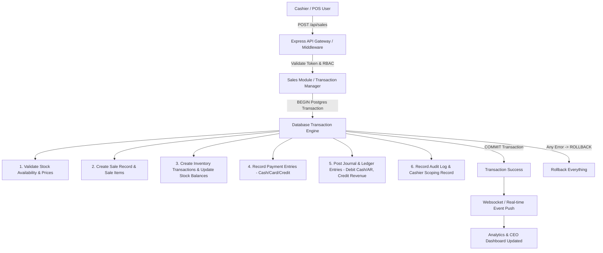

# SYSTEM ARCHITECTURE SPECIFICATION

## Executive Overview
This document specifies the system architecture for our Startup ERP, POS, Inventory, and Accounting Platform. The platform is designed to handle retail POS operations across multiple branches, central warehouse inventory operations, wholesale/B2B credit sales, future e-commerce channel sales, real-time double-entry accounting, and executive analytics for the CEO dashboard.

---

## 1. High-Level Core Transaction Flow



---

## 2. Recommended Tech Stack

| Layer | Technology Choice | Rationale |
| :--- | :--- | :--- |
| **Frontend Framework** | React 19 + TypeScript + Vite | Maximum speed, type-safety, fast UI re-renders for cashier POS. |
| **Styling** | Vanilla CSS + Modern CSS Variables | Vibrant custom aesthetics, glassmorphism, responsive performance without heavy utility bloat. |
| **State Management** | Zustand + TanStack React Query 5 | Zustand for POS Cart local state; React Query for server cache & optimistic UI. |
| **Backend Framework** | Node.js 20 + Express 5 + TypeScript 5.9 | High throughput REST APIs, clear layer separation, unified TS types. |
| **ORM / Query Engine** | Prisma ORM 5 + PostgreSQL 15 | Strict schema migrations, auto-generated TypeScript types, atomic `$transaction`. |
| **Database** | PostgreSQL 15 | Robust ACID compliance, transactional integrity, JSONB support for audit metadata. |
| **Precision Math** | `decimal.js` | Prevents floating-point rounding errors in currency and inventory math. |
| **Authentication** | JWT (Access + Refresh Tokens) + Argon2id / bcrypt | Secure RBAC with session validation and cashier scoping. |
| **Validation** | Zod | Shared validation schema between frontend forms and backend API middleware. |

---

## 3. Modular System Architecture

### 3.1 Backend Modular Structure (`/backend`)
```
/backend
├── /prisma
│   ├── schema.prisma          # Single source of truth database model
│   └── migrations/            # Version-controlled migrations
├── /src
│   ├── /config                # Environment variables, database connection, secrets
│   ├── /middleware            # Auth, RBAC, error handler, rate limiter, logger
│   ├── /utils                 # Precision math helpers (Decimal.js), receipt formatters
│   ├── /modules
│   │   ├── /auth              # Authentication & Token Management
│   │   ├── /users             # User accounts & Profile settings
│   │   ├── /roles             # RBAC Role & Granular Permission management
│   │   ├── /branches          # Multi-branch location master
│   │   ├── /warehouses        # Central warehouse & stock locations
│   │   ├── /categories        # Product categories
│   │   ├── /products          # Product catalog & pricing tiers
│   │   ├── /inventory         # Stock ledger, movement audit, low-stock alerts
│   │   ├── /transfers         # Inter-branch & warehouse stock transfers
│   │   ├── /suppliers         # Supplier management & performance
│   │   ├── /purchases         # POs, Goods Receipts (GRN), Supplier Bills
│   │   ├── /customers         # Customer profiles, B2B pricing, credit limits
│   │   ├── /sales             # Atomic Sales Engine (POS, B2B, Online)
│   │   ├── /payments          # Payment processing & cash drawer management
│   │   ├── /accounting        # Chart of Accounts, Ledger, Journal Entries, P&L
│   │   ├── /expenses          # Expense recording & categorization
│   │   ├── /returns           # Sales returns, customer credit notes, restocking
│   │   ├── /analytics         # Analytical aggregation engine
│   │   ├── /reports           # PDF/CSV report generation
│   │   └── /audit             # Immutable system audit logs
│   ├── app.ts                 # Express application setup
│   └── server.ts              # HTTP Server listener
```

### 3.2 Frontend Modular Structure (`/frontend`)
```
/frontend
├── /public                    # Static assets, favicon, offline manifest
├── /src
│   ├── /assets                # Images, icons, CSS variables
│   ├── /components            # Reusable UI components (Modal, Button, Table, Badge, Card)
│   ├── /context               # Auth context & global application providers
│   ├── /hooks                 # Custom hooks (usePOS, useScan, useDebounce)
│   ├── /lib                   # API client (Axios), formatters, currency helpers
│   ├── /styles                # App design system & vanilla CSS rules
│   ├── /types                 # Shared TypeScript interfaces & DTOs
│   └── /modules
│       ├── /auth              # Login & Password reset views
│       ├── /pos               # High-speed cashier POS interface
│       ├── /inventory         # Stock list, transfers, adjustments view
│       ├── /purchases         # Purchase orders & GRN receiving
│       ├── /sales             # Sales history, invoices, receipt views
│       ├── /customers         # Customer list, B2B credit & ledger view
│       ├── /suppliers         # Supplier records & purchasing history
│       ├── /accounting        # Chart of Accounts, Journal Entries, P&L, Balance Sheet
│       ├── /expenses          # Expense log & category management
│       ├── /reports           # Financial & inventory operational reports
│       ├── /admin             # Users, roles, branch & warehouse settings
│       └── /ceo-dashboard     # Executive KPI overview & date-filtered analytics
```

---

## 4. Key Architectural Sub-Systems

### 4.1 Double-Entry Accounting Engine
No financial numbers are ever calculated through manual floating-point arithmetic or isolated counters.
All financial events create balanced **Journal Entries** targeting the **Chart of Accounts**:

$$\sum \text{Debits} = \sum \text{Credits}$$

#### Core Account Types & Flow:
1. **Assets** (Cash, Bank, AR, Inventory Asset)
2. **Liabilities** (Accounts Payable, Customer Deposits, Tax Payable)
3. **Equity** (Retained Earnings, Capital)
4. **Revenue** (Sales Revenue, B2B Revenue, Shipping Revenue)
5. **Expenses** (Cost of Goods Sold - COGS, Operating Expenses, Rent, Utilities)

#### Transaction Mapping Example (Cash Sale of \$100 with COGS \$60):
- **Debit:** Cash Account (Asset) \$100
- **Credit:** Sales Revenue Account (Revenue) \$100
- **Debit:** COGS Account (Expense) \$60
- **Credit:** Inventory Asset Account (Asset) \$60

### 4.2 Multi-Location Inventory Engine
- Inventory is tracked per **Location** (Warehouse ID or Branch ID).
- Stock levels are **NEVER** modified directly by frontend requests.
- Every stock movement generates an immutable **Inventory Transaction** record with:
  - `product_id`, `location_id`, `quantity`, `type` (SALE, PURCHASE, TRANSFER_IN, TRANSFER_OUT, ADJUSTMENT, RETURN, DAMAGE), `reference_type`, `reference_id`, `user_id`, `timestamp`.
- **Stock Balance** table maintains the real-time calculated balance per location to accelerate POS lookups while being strictly verifiable against the transaction log.

### 4.3 Multi-Channel Architecture (Retail POS, B2B Wholesale, Online E-Commerce)
Sales are processed through a single **Sales Engine** regardless of origin:
- `sales.channel`: `RETAIL` (POS Cashier), `B2B` (Wholesale Credit Order), `ONLINE` (Webstore Order).
- All 3 channels utilize the same stock deduction engine, ledger posting rules, and financial reporting pipeline.

---

## 5. Security & Permission Matrix (RBAC)

| User Role | POS Checkout | Adjust Stock | Access Ledger / COA | View Profit KPIs | Manage Users |
| :--- | :---: | :---: | :---: | :---: | :---: |
| **CASHIER** | ✅ | ❌ | ❌ | ❌ | ❌ |
| **WAREHOUSE_MANAGER** | ❌ | ✅ | ❌ | ❌ | ❌ |
| **ACCOUNTANT** | ❌ | ❌ | ✅ | ✅ | ❌ |
| **MANAGER** | ✅ | ✅ | ❌ | ✅ | ❌ |
| **ADMIN** | ✅ | ✅ | ✅ | ✅ | ✅ |
| **CEO** | 👁️ (Read) | 👁️ (Read) | 👁️ (Read) | 👁️ (Read) | 👁️ (Read) |
